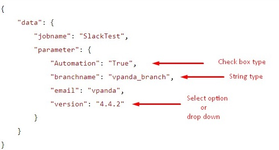

# Jenkins Microservice

This microservice is used to execute jenkins job on the specified jenkins server. It require jenkins user credentials such as login id and [jenkins api-token](https://jenkins.io/blog/2018/07/02/new-api-token-system/) with job details to fire the job.

## Installation
### Checkout Repository
```sh
git clone https://github.com/swiftops/jenkins-service.git
```

### 1. Deploy inside Docker
---
#### Pre-Requisite
*   Docker should be installed on your machine. Refer [Install Docker](https://www.digitalocean.com/community/tutorials/how-to-install-and-use-docker-on-ubuntu-16-04) documentation.
*   Jenkins server installed and running. Refer [Install Jenkins](https://jenkins.io/download/) documentation. Also make sure that atleast one job is created.
*   Specify Jenkins credentials in config.ini 

#### Steps to start microservice
Once you are done with pre-requisite execute below command in the checkout directory to start Jenkins microservice.
```sh
docker build -t <image-name> .
docker run -p 8098:8098 --name <container_name> -d <image-name>
```

### 2. On Commit Auto-deploy on specific server
---
To autodeploy your docker container based service on server used below steps
You need to configure Gitlab Runner to execute Gitlab CI/CD Pipeline. See [Gitlab Config](https://docs.gitlab.com/runner/install)
Change ip address in deploy.sh file with your IP on which autodeploy needs to be done.
As soon as you configure runner auto deployment will start as you commited the code in repository.
refer .gitlab-ci.yml file.

### 3. Deploy on local environment
---
#### Create Virtual Environment
Virtualenv is the easiest and recommended way to configure a custom Python environment for your services.
To install virtualenv execute below command:
```sh
pip3 install virtualenv
```
You can check version for virtual environment version by typing below command:
```sh
virtualenv --version
```
Create a virtual environment for a project:
```sh
cd my_project_folder
virtualenv virtenv
```
virtualenv `virtenv` will create a folder in the current directory which will contain the Python executable files, and a copy of the pip library which you can use to install other packages. The name of the virtual environment (in this case, it was `virtenv`) can be anything; omitting the name will place the files in the current directory instead.

This creates a copy of Python in whichever directory you ran the command in, placing it in a folder named `virtenv`.

You can also use the Python interpreter of your choice (like python3.6).
```sh
virtualenv -p /usr/bin/python3.6 virtenv
```
To begin using the virtual environment, it needs to be activated:
```sh
source virtenv/bin/activate
```
The name of the current virtual environment will now appear on the left of the prompt (e.g. (virtenv)Your-Computer:your_project UserName$) to let you know that it’s active. From now on, any package that you install using pip will be placed in the virtenv folder, isolated from the global Python installation. You can add python packages needed in your microservice development within virtualenv. 

#### Install python module dependencies
```sh
pip install -r requirements.txt
```

#### To start microservice 
```sh
python services.py
```

### 4. How to use this service
Fire the below post request with jsonified data.Also, make sure that the specified job with the passed parameter exist on jenkins server. Refer the below example for data format.
```http
http://<yourip>:8098/build
```

